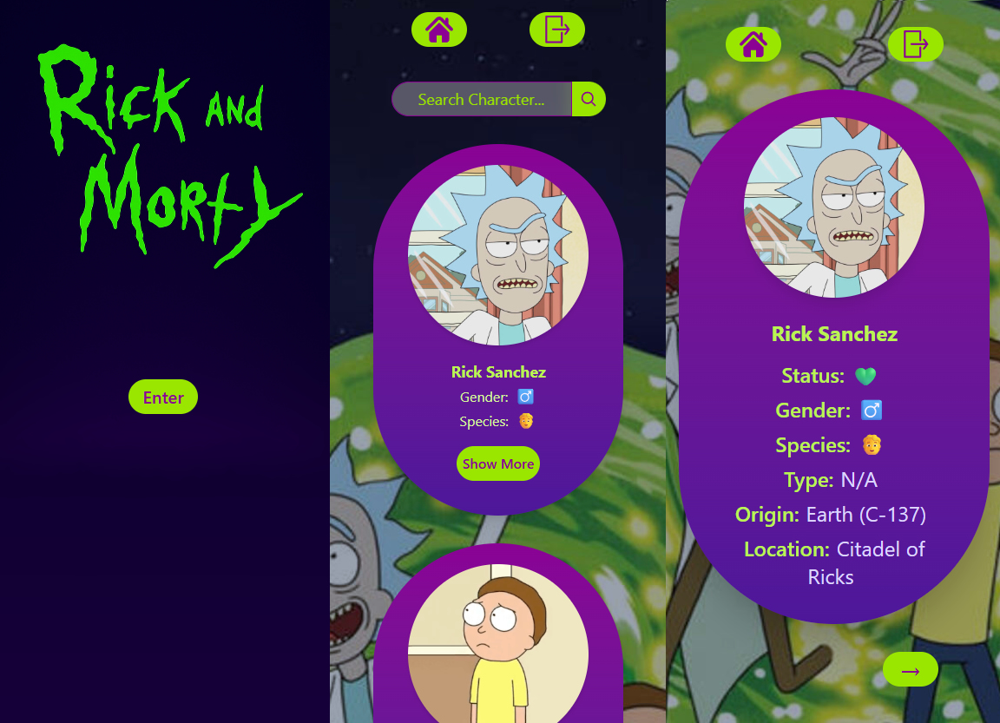
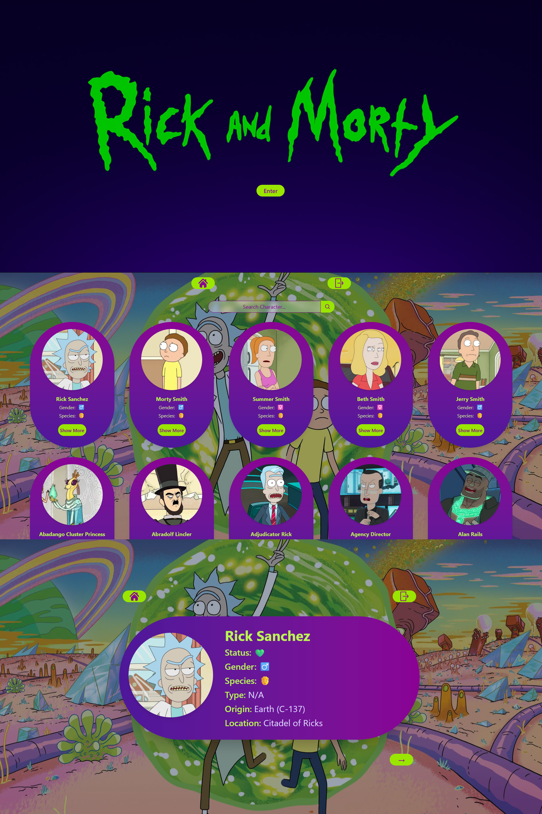

<h1 align="center">🛸 Rick and Morty Project</h1>

<p align="center">
  <a href="https://rick-and-morty-project-vue.netlify.app/">
    
  </a>
    
   
  
 

</p>

<table align="center">
  <tr>
    <td></td>
    <td></td>
  </tr>
</table>

Meet the multiverse’s most chaotic characters!   

Dive into this **mobile-first web app** to search and discover Rick and Morty characters by name — all powered by the [Rick and Morty API](https://rickandmortyapi.com/).  

I built this app to practice **Vue.js**, **JavaScript**, and **Tailwind CSS** — and, naturally, to explore the quirkiest characters in the multiverse. 🚀

## 🎯 Features

- Browse characters from the **Rick and Morty universe**  
- Search for characters by **name**  
- Navigate through results with **pagination**  
- **Mobile-first design** that works great on desktop too 😉  
- Smooth data fetching using the native **Fetch API**  
- State management with **Pinia** and routing with **Vue Router**
  
## ⚡ How to Run It

**1. Clone the repo**

```sh
git clone https://github.com/evi-fil/RickAndMortyProject.git
```

```sh
cd RickAndMortyProject
```

**2. Install dependencies**

```sh
npm install
```

> **Note for Windows PowerShell users:**  
> If you see an error like `running scripts is disabled`, run this first:  
> ```sh
> Set-ExecutionPolicy -Scope Process -ExecutionPolicy Bypass
> ```  
> Then run `npm install` again. This is temporary and safe.

**3. Start the development server**

```sh
npm run dev
```
Open your browser at the URL shown in the terminal (usually `http://localhost:5173`).

Or, check out the app live here: [Rick and Morty Project](https://rick-and-morty-project-vue.netlify.app/)

Boom! Explore the multiverse of Rick and Morty characters. 🚀

## 🛠️ Built with

- HTML5
- Tailwind CSS
- JavaScript
- [Vue.js](https://vuejs.org/) (framework)
- [Rick and Morty API](https://rickandmortyapi.com/)
- [Pinia](https://pinia.vuejs.org/) (state management)
- [Vue Router](https://router.vuejs.org/) (routing)
- [Postman](https://www.postman.com/) (for testing API requests)
- [Netlify](https://www.netlify.com/) (for deployment)

## ✨ Notes / Personal touches

This project began as a way to **learn Vue.js**, but it quickly grew into a deeper dive into the framework — exploring **state management with Pinia**, **routing with Vue Router**, and implementing **pagination** for a smoother user experience.

It was a real challenge at times — especially wrapping my head around **components**, **reactivity**, and **state flow** — but it helped me gain a much clearer picture of how **Vue** works in practice.

I also designed the **UX/UI** myself, putting special care into **responsiveness** and overall **user experience**.

I used **Postman** to test API calls before connecting them to the app, ensuring clean and reliable data fetching.  
The project is hosted on **Netlify**, so you can explore it live without setup.

🛸 *This project is still in progress — new improvements are coming soon!* 

## 🔒 License / Usage

© 2025 @evi-fil. All rights reserved.  

This project is for **portfolio and demonstration purposes only**.  
Do **not copy, reuse, or redistribute** the code without permission.  

Note: Character data is provided by the [Rick and Morty API](https://rickandmortyapi.com/), which may have separate copyright.


